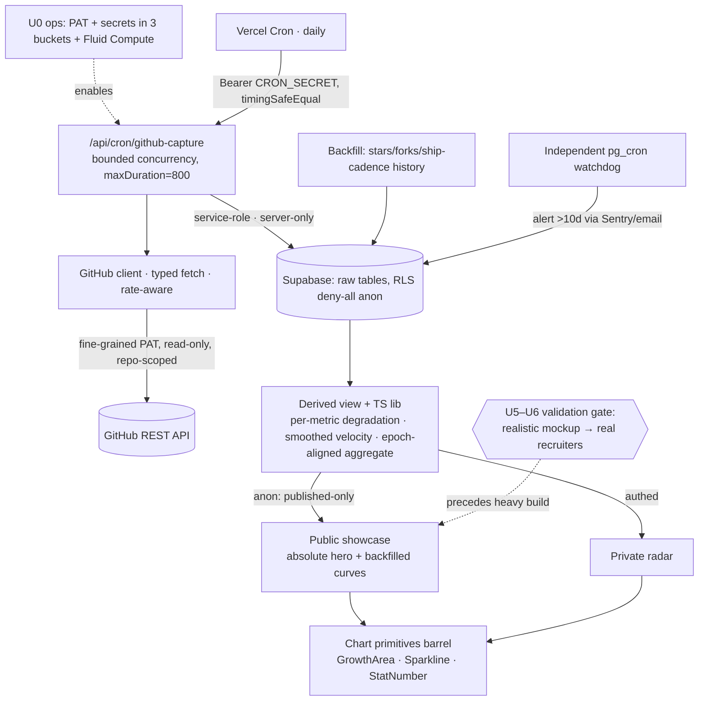

# feat: Groundswell — developer-traction showcase

## Summary

Build Groundswell as a Next.js + Supabase + Vercel app on a **protect-then-prove** sequence: an ops prerequisite and a minimal self-healing capture loop ship first to stop perishable GitHub data from being lost; a cheap validation gate (a realistic-data mockup shown to real recruiters) tests the core premise before the heavy build; then the derived layer, the bespoke charts, and the public showcase — which launches led by *backfillable* signals plus an honest absolute aggregate so it never appears empty during cold-start; then the private radar.

---

## Problem Frame

See `origin` for full motivation. Modest per-project numbers read as weak in isolation; GitHub destroys the strongest signals over time (release `download_count` has no history; views/clones live in a 14-day owner-only window). Value comes from aggregating many signals across many projects, leading with growth, and from capturing perishable data before it expires. A second use — telling which projects are growing — needs the same time-series spine.

This v2 plan responds to a seven-persona document review. Three review findings reshaped it: (1) **cold-start** — the showcase's growth-curve payload is impossible at launch because only stars/forks are backfillable, so the launch state must lead with backfillable signals + an absolute anchor; (2) **unvalidated premise** — whether a recruiter is moved by these metrics is testable cheaply before the spine is built; (3) **fused urgencies** — "protect perishable data" and "ship a shareable page" were one long backend-first chain and are now decoupled.

---

## Requirements

Traceable to `origin` R-IDs. Grouped by concern.

- **Capture spine** — R1–R5: scheduled timestamped snapshots; capture persists from day one independent of UI; source-agnostic model; safe re-runs; each signal records its data-availability class.
- **Signals (v1: GitHub, owner repos)** — R6–R9: downloads, stars, forks, watchers, views, clones, referrers, ship-cadence; owner-only signals flagged; backfillable signals reconstructed where the source allows; non-GitHub sources accommodated but unwired.
- **Derived metrics** — R10–R12: velocity + growth% over windows; aggregate cross-project totals + roll-up; graceful degradation under sparse history.
- **Public showcase (ships first among UI surfaces)** — R13–R17: public, recruiter-credible in 3s, momentum-supported; killer-project detail; curated/published-only; linkable + image-exportable.
- **Private radar (fast-follow)** — R18–R19: rank by growth/velocity; per-project/per-signal trends including perishable signals.
- **Curation & visibility** — R20–R21: explicit owner-maintained tracked list; per-project/per-signal public visibility independent of capture.
- **Design quality** — R22–R24: dual-standard presentation; small numbers render credible; mockup-first approval gate before any UI primitive.
- **Generalization** — R25: personal-first, structured so public self-serve is additive.

---

## Key Technical Decisions

- KTD1. **14-day self-healing re-upsert.** Each run pulls the full 14-day traffic window and upserts on `(repo, metric, day)` `ON CONFLICT DO UPDATE`; data is lost only after **14 consecutive dark days** (defined term, used consistently). **Uniques are non-additive** — daily `uniques` cannot be summed into a window/monthly figure, so GitHub's window-level `uniques` total is persisted separately at capture time; the derived layer never sums daily uniques. Referrers (no per-day axis) are upserted keyed `(repo, referrer, day)`. (R2, R4, R5)

- KTD2. **Source-agnostic snapshot model** — `(project, source, metric, value, captured_at, data_class)`; new sources/metrics add rows, not schema. Justified by R3/R9/R25 at one-column cost; v1 wires GitHub only and must not build source adapters/registries. (R3, R9)

- KTD3. **Vercel Cron → route handler, bounded concurrency.** A `CRON_SECRET`-gated route (`runtime="nodejs"`, `dynamic="force-dynamic"`, `maxDuration=800` — which **requires Fluid Compute enabled**, see U0) runs the daily poll. Concurrency is **bounded** by a `runBounded(tasks, N)` limiter (the plan's cited cron learning is explicit that unbounded `Promise.all`/`allSettled` is the scaling cliff), with the AbortController signal threaded through every `fetch`. Service-role admin client for writes. An **independent freshness watchdog ships in v1**: a Supabase pg_cron job checks `last_successful_capture_at` and fires a real alert at >10 days via `pg_net` `net.http_post` to an alert target (Sentry ingest / a Vercel alert route / Telegram bot), secret read from Supabase Vault (boxbox `cron_jobs` precedent) — it must not be co-located with the app-side scheduler it monitors. (R1)

- KTD4. **Hand-rolled chart primitives: `d3-shape` + `motion` + SVG** (owner's explicit "build primitives / award-grade" call). One shared path helper powers `<GrowthAreaChart>` + `<Sparkline>`; `<StatNumber>` is animated HTML. Exposed through a single `src/components/charts/index.ts` barrel so the documented Recharts v3 fallback is a real escape hatch (swap behind the barrel without touching consumers). Tooltips via portal. **Never co-plot backfilled and capture-started series on a shared axis without a per-series "tracking started" boundary marker; watchers (no event log) are excluded from any over-time framing.** (R22, R23)

- KTD5. **Least-privilege fine-grained PAT** — `Administration:Read` + `Contents:Read` + `Metadata:Read`, read-only, **scoped only to the tracked repos** (not the account/org). `Administration:Read` also exposes webhooks, deploy keys, and repo security config — documented blast radius; **90-day max TTL with a calendar rotation reminder** (a silently expired token reintroduces the perishable-data loss the product exists to prevent). Typed raw-`fetch` client; read rate-limit headers; honor `Retry-After`. (R6, R7)

- KTD6. **Derived metrics layer** (SQL views + thin TS lib). Degradation is evaluated **per `(project, metric)` series**, not per project — a fresh repo shows a backfilled star curve *and* a "tracking started" marker on download velocity simultaneously. Download velocity is **smoothed over a trailing window** (not day-over-day) and **percentage framing is suppressed below an absolute-count floor** (show the absolute delta instead — "+12 this month", not "+100%"). Cross-signal aggregates **align all series to a common capture epoch** so backfilled stars don't distort the roll-up shape. (R10–R12)

- KTD7. **Protect-then-prove sequencing.** Minimal capture (U4) ships before any UI to stop perishable loss; a validation gate (U5–U6: realistic-data mockup → real recruiters) precedes the heavy build; the early public showcase leads with **backfillable** signals (stars/forks/ship-cadence) plus an absolute aggregate anchor, with perishable velocity filling in over time. Decouples the two real urgencies the review flagged as fused.

- KTD8. **Watcher count from `subscribers_count`**, never `watchers_count` (a GitHub alias for star count). One `GET /repos/{owner}/{repo}` yields stars, forks, and watchers. (R6)

- KTD9. **CI inside the `pnpm build` chain, not GitHub Actions** (`type-check && lint && test && next build`; explicit `vercel.json` buildCommand; `build:next` escape hatch; `simple-git-hooks` + `lint-staged`; `pnpm-workspace.yaml` `allowBuilds`). Pin `NODE_ENV=test` per-command (Vercel sets `NODE_ENV=production`, stripping React `act`). Tailwind v4 `globals.css` uses `@import "tailwindcss" source(none)` + explicit `@source`. Mirrors `~/developer/allages`.

- KTD10. **Auth + secret boundary.** Public showcase unauthenticated; private radar + curation use Supabase auth with a **Next 16 `proxy.ts`/`proxy()`** session-refresh handler (a file named `middleware.ts` is ignored on Next 16 — the auth gate would silently not run). The service-role key is imported only through a module guarded by the `server-only` package + a lint rule, so it can never reach a client bundle. **RLS is DENY-ALL for anon on every base table** (`projects`, `traffic_daily`, `traffic_window`, `traffic_referrers`, `signal_snapshots`, `stars`, `forks`, `capture_runs`); the public showcase reads exclusively from the published-only `public_showcase` view joined on per-signal visibility (DENY-ALL on `projects` is belt-and-suspenders behind the view — a direct `projects` SELECT must not leak the unpublished repo roster or visibility flags). `CAPTURE_ENABLED` defaults OFF until U0 ops verify; `CRON_SECRET` compared with `timingSafeEqual`. (R13, R18, R21)

- KTD11. **Own dedicated Supabase project** (standalone instance, `public` schema) — not the shared instance. RLS + policies in the same migration; `created_at`/`updated_at`; soft-delete via `deleted_at`.

- KTD12. **Absolute aggregate is the honest hero anchor.** The hero leads with a real, large, aggregate absolute — total downloads across projects (available immediately from cumulative counts) + total stars — with velocity/momentum as the *supporting* modifier. A percentage without a denominator reads as evasive to a recruiter; the aggregate absolute is both immediately available and credible during cold-start. (R11, R14)

---

## High-Level Technical Design

One capture spine writes the snapshot store; everything reads derived views off it. The capture (service-role write) and read (anon/auth) paths never share a trust boundary. An independent DB-side watchdog monitors the app-side scheduler.



The **validation gate** sits before the showcase build; the **watchdog** is independent of the app-side cron; perishable signals route through the 14-day re-upsert; the **absolute hero** is available immediately while curves backfill.

---

## Output Structure

```
groundswell/
├── package.json · vercel.json · renovate.json · pnpm-workspace.yaml · tsconfig.json
├── proxy.ts                                  # Next 16 session refresh (NOT middleware.ts)
├── src/app/globals.css                       # Tailwind v4 @theme (tokens inline, no W3C json in v1)
├── supabase/migrations/                      # 00001 schema + RLS deny-all, 00002 derived view
├── docs/mockups/2026-…-showcase-options.html # ranked, realistic-data, approval + validation gate
├── scripts/backfill.ts                       # stars/forks/ship-cadence history
└── src/
    ├── app/
    │   ├── (public)/                          # showcase (unauth)
    │   ├── (app)/                             # radar + curation (auth, proxy-gated)
    │   └── api/cron/github-capture/route.ts
    ├── lib/{env,github,supabase,metrics}/     # supabase/admin.ts is server-only-guarded
    └── components/charts/index.ts             # barrel; Recharts fallback swaps here
```

---

## Implementation Units

### Phase 0 — Ops prerequisite (no code; starts the perishable clock)

#### U0. Ops setup
- **Goal:** Make capture runnable before any code expects it, so the perishable clock starts the day U4 lands.
- **Requirements:** Enables R1, R2; KTD5, KTD10, KTD11.
- **Dependencies:** none.
- **Files:** none (Vercel + Supabase + GitHub dashboards); record completion in `STATUS.md`.
- **Approach:** Create the dedicated Supabase project. Mint the fine-grained PAT scoped to the tracked repos with `Administration:Read` + `Contents:Read` + `Metadata:Read`; set a 90-day expiry + calendar rotation reminder. Set `GITHUB_TOKEN`, `CRON_SECRET`, Supabase URL/anon/service-role in all three Vercel buckets; `CAPTURE_ENABLED=false` everywhere initially, and explicitly `false` in Preview. Enable **Fluid Compute** (required for `maxDuration=800`).
- **Test scenarios:** `Test expectation: none — ops checklist.`
- **Verification:** secrets present in Dev/Preview/Prod; Fluid Compute on **and confirmed to permit an 800s function ceiling on this plan** (if it doesn't, U4 must shard repos across invocations rather than rely on one long run); PAT scoped to tracked repos only; rotation reminder set.

### Phase A — Scaffold + minimal self-healing capture (stop the bleed)

#### U1. Scaffold, CI, infra
- **Goal:** Next.js app with the canonical CI chain, env validation, Supabase clients (with a server-only-guarded admin client), Sentry.
- **Requirements:** Foundation; KTD9, KTD10, KTD11.
- **Dependencies:** U0.
- **Files:** `package.json`, `vercel.json`, `renovate.json`, `pnpm-workspace.yaml`, `tsconfig.json`, `.gitignore`, `.env.example`, `src/lib/env.ts`, `src/lib/supabase/{client,server,admin}.ts`, `proxy.ts`, `sentry.*.config.ts`, `STATUS.md`, `ISSUES.md`, `CLAUDE.md`.
- **Approach:** Clone `~/developer/claritas` for the src/ App Router + client/server Supabase clients; take the **admin client + `server-only` guard + CI import-barrier** pattern from `~/developer/fourposts/site` (claritas has no admin client). Overlay `~/developer/allages` (build chain, `vercel.json`, `pnpm-workspace.yaml` `allowBuilds`, `renovate.json`). `src/lib/supabase/admin.ts` imports the `server-only` package so a client-bundle import fails the build; add a lint rule barring `admin` imports from `(public)`/client components. Zod env: when `CAPTURE_ENABLED=true`, require non-empty `GITHUB_TOKEN`/`CRON_SECRET` (min-entropy check on the latter). Vitest + jsdom, `NODE_ENV=test` pinned per-command.
- **Patterns to follow:** `claritas/src/lib/supabase/` (client/server); `fourposts/site/lib/supabase/admin.ts` + `fourposts/site/__tests__/admin-import-barrier.test.ts` (admin client + `server-only` guard); `allages/package.json`, `allages/pnpm-workspace.yaml`; `fourposts/site/proxy.ts`.
- **Test scenarios:** env schema rejects missing secrets when `CAPTURE_ENABLED=true`; building a client component that imports `admin.ts` fails the build; `pnpm build` runs the full chain.
- **Verification:** `pnpm build` green; admin client unreachable from client bundle.

#### U2. Snapshot schema + RLS + derived-read view
- **Goal:** Durable store with a hard anon/owner trust boundary and correct uniques handling.
- **Requirements:** R1, R3, R5, R9, R20, R21; KTD1, KTD2, KTD10, KTD11.
- **Dependencies:** U1.
- **Files:** `supabase/migrations/00001_snapshot_model.sql`, `src/types/database.ts`.
- **Approach:** Tables — `projects` (curated list, per-signal `visibility`, `deleted_at`), `signal_snapshots` (`project_id, source, metric, value, data_class, captured_at`), `traffic_daily` (`repo, metric, day, count, uniques`, unique `(repo, metric, day)`), `traffic_window` (window-level `uniques`/`count` per capture — uniques are non-additive, KTD1), `traffic_referrers` (`repo, referrer, day, count, uniques`), `stars`/`forks` (entity + timestamp for backfill), `capture_runs` (`last_successful_capture_at`, status). **Anon RLS: DENY-ALL on every raw table**; expose a `public_showcase` view that returns only published-visibility rows; writes service-role only. `created_at`/`updated_at` triggers.
- **Patterns to follow:** `fourposts/.claude/rules/supabase.md`.
- **Execution note:** Test-first for the RLS boundary.
- **Test scenarios:** anon cannot SELECT any base table — incl. direct queries against `signal_snapshots`/`traffic_daily`/`traffic_window`/`traffic_referrers`, and a direct `projects` SELECT (must not leak the unpublished repo roster or per-signal visibility flags); anon reading `public_showcase` returns only published rows; `capture_runs` denies anon; `(repo,metric,day)` uniqueness holds; soft-deleted projects excluded.
- **Verification:** migration applies; anon client provably cannot read unpublished/raw data.

#### U3. GitHub API client
- **Goal:** Typed, rate-aware, paginated read client for every v1 signal.
- **Requirements:** R6, R7, R8; KTD5, KTD8.
- **Dependencies:** U1.
- **Files:** `src/lib/github/{client,types}.ts`, `src/lib/github/client.test.ts`.
- **Approach:** Raw `fetch` (`Bearer`, `Accept: application/vnd.github+json`, `X-GitHub-Api-Version: 2022-11-28`). `getRepoSummary` (stars/forks/`subscribers_count`), traffic views/clones (+ window-level totals)/referrers, `listReleases`, `listStargazers` (`star+json` → `starred_at`), `listForks`. Read `x-ratelimit-*`; honor `Retry-After`; null-guard/bounds-clamp every field.
- **Patterns to follow:** `faculty-meeting/api/feedback.js`; `claritas/src/lib/openalex/`.
- **Execution note:** Test-first for parsing contracts.
- **Test scenarios:** watchers map from `subscribers_count` not `watchers_count`; `starred_at` parsed only with `star+json`; pagination completes; window-level uniques captured distinct from daily; 403 + `Retry-After` backs off; null field degrades.
- **Verification:** unit tests green on fixtures.

#### U4. Minimal self-healing capture cron + watchdog
- **Goal:** The headless loop that stops perishable loss — bounded, idempotent, self-healing, monitored.
- **Requirements:** R1, R2, R4, R6, R7; KTD1, KTD3, KTD10.
- **Dependencies:** U2, U3.
- **Files:** `src/app/api/cron/github-capture/route.ts`, `src/lib/capture/runBounded.ts`, `vercel.json` (crons), `supabase/migrations/00003_watchdog.sql`, `src/app/api/cron/github-capture/route.test.ts`.
- **Approach:** `GET`, `runtime="nodejs"`, `dynamic="force-dynamic"`, `maxDuration=800`; reject non-matching bearer via `timingSafeEqual` → 401. Service-role client. **Bounded concurrency** via `runBounded(repos, N, worker)` — the worker closure owns threading the AbortController `signal` into every `fetch`; `runBounded` returns a result-envelope (`{ok,value}|{ok,error}` per repo), so the route **inspects the envelope** and records per-repo success/failure in `capture_runs`. **Abort budget:** fire `abort()` at ~770s (leave headroom under the 800s ceiling for the final `capture_runs`/window writes to flush) — re-derived from the cited learning's 55s/60s ratio, not copied. Per repo: summary + full 14-day views/clones (**upsert all 14 days** + persist window-level uniques) + referrers + releases (snapshot cumulative `download_count`; on a missed day the next delta spans >1 day — record a `span_days` marker so U8 smoothing doesn't read it as a spike) + append new stars/forks. **Advance `last_successful_capture_at` only when the envelope is all-ok** (a partial-failure run does not reset the watchdog clock). `CAPTURE_ENABLED` gate. `Sentry.captureException(err,{tags:{action:"capture",phase}})`. Watchdog migration (`00003_watchdog.sql`): pg_cron + `pg_net` http_post + Vault secret, alerting at >10 days (boxbox precedent).
- **Patterns to follow:** `fourposts/site/app/api/cron/rate-limit-cleanup/route.ts`; `summer93/docs/solutions/architecture-patterns/vercel-cron-upstash-push-fanout-2026-05-21.md` (runBounded, AbortController).
- **Execution note:** Test-first for auth gate + idempotency.
- **Test scenarios:** wrong bearer → 401; **Covers R4.** re-run same day upserts (no dup `traffic_daily`, counts overwritten); a 5-day gap then success backfills the window without corruption; concurrency never exceeds N; one repo throwing doesn't kill the batch; `CAPTURE_ENABLED=false` no-ops; window-level uniques stored, never summed from dailies; watchdog fires at >10 days.
- **Verification:** seeded repo gets a 14-day window; second run idempotent; watchdog alert path tested.

### Phase B — Validation gate (cheap; before heavy build)

#### U5. Design system + realistic-data mockups (APPROVAL GATE)
- **Goal:** Establish the visual language and produce the mockup that both gets design sign-off and drives recruiter validation.
- **Requirements:** R22, R23, R24, R13, R14; KTD4, KTD7, KTD12.
- **Dependencies:** none (parallel to Phase A; gates Phase C).
- **Files:** `src/app/globals.css` (Tailwind `@theme` — tokens inline, no W3C json in v1), `docs/mockups/2026-06-10-showcase-options.html`, `docs/design-system/CONSUMES.md`.
- **Approach:** Invoke `compound-engineering:frontend-design` (Layer-0; visual thesis/content/interaction plans). Three-layer tokens incl. data-viz tokens, mapped to Tailwind `@theme`. Ranked mockups (3–4, RANK 1 RECOMMENDED…REJECTED) populated with **realistic modest numbers** (hundreds of downloads, single-digit daily deltas) and the cold-start state (absolute hero + backfilled curves + "tracking started" on young signals). Resolve in the mockup: first-screen IA, navigation, per-card hierarchy, empty/loading/error content, responsive/mobile breakpoints, tooltip interaction (hover + keyboard + mobile tap), dark-mode decision (recommend lock-to-light for v1). **Wait for owner approval.**
- **Patterns to follow:** `fourposts/CLAUDE.md` Tier-2 mockup HARD STOP; `fourposts/docs/solutions/patterns/locked-visual-language-v1-primitives-first-design-system-2026-05-18.md`.
- **Test scenarios:** `Test expectation: none — design artifact.`
- **Verification:** owner approves a ranked mockup with cold-start + mobile + states resolved.

#### U6. Recruiter validation
- **Goal:** Falsify (or confirm) the premise that the metrics move a recruiter, before the spine's heavy build.
- **Requirements:** Validates the origin's recruiter premise + success criteria.
- **Dependencies:** U5.
- **Files:** `docs/validation/2026-…-recruiter-feedback.md`.
- **Approach:** Show the approved realistic-data mockup to 2–3 real recruiters / friendly hiring managers. Ask what they conclude in the first seconds, what they trust, what reads as evasive. Record findings; decide: proceed as-is, adjust framing (e.g., lean harder on absolute aggregate or craft), or rethink. This is a knowledge-work gate, not code.
- **Test scenarios:** `Test expectation: none — validation gate.`
- **Verification:** ≥2 recruiter reactions captured; an explicit proceed/adjust decision recorded before Phase C.

### Phase C — Backfill, derived metrics, charts, showcase

#### U7. Backfill script
- **Goal:** Reconstruct the history that makes the cold-start showcase non-empty.
- **Requirements:** R8; KTD5, KTD7.
- **Dependencies:** U2, U3.
- **Files:** `scripts/backfill.ts`.
- **Approach:** Walk stargazers (`star+json` → `starred_at`) and forks (`created_at`); reconstruct **ship-cadence** from commit + release history. Throttle under secondary limits (<900 pts/min, sequential). Idempotent upsert. Downloads are not backfillable (start at capture date).
- **Execution note:** Test-first for pagination + idempotency.
- **Test scenarios:** pagination completes; re-run no-ops; ship-cadence series built from history; downloads NOT backfilled.
- **Verification:** citegeist gets star + ship-cadence curves; re-run idempotent.

#### U8. Derived metrics layer
- **Goal:** The velocity/growth/aggregate numbers, computed correctly for sparse, mixed-provenance, low-count data.
- **Requirements:** R10, R11, R12; KTD1, KTD6, KTD12.
- **Dependencies:** U2 (data); U7 enriches but is **not** a hard gate (sparse history degrades per R12).
- **Files:** `supabase/migrations/00002_derived_views.sql`, `src/lib/metrics/derive.ts`, `src/lib/metrics/derive.test.ts`.
- **Approach:** Per-day download deltas (diff cumulative); **smoothed** velocity over a trailing window; growth% **suppressed below an absolute-count floor** (fall back to absolute delta); aggregate roll-up **aligned to a common capture epoch**; **window-level uniques used directly, never summed**; per-`(project,metric)` degradation with a "tracking started" marker.
- **Execution note:** Test-first — correctness-critical.
- **Test scenarios:** **Covers AE1.** single snapshot → absolute + "tracking started", no false 0%; **Covers AE5.** monthly uniques use the window total, never the sum of dailies; below the count floor, % is suppressed and an absolute delta shown; **Covers AE4.** backfilled stars curve while downloads start at capture date (per-metric); aggregate aligns mixed start dates to one epoch; smoothed velocity is stable when daily downloads are a 0/1/3 spike train.
- **Verification:** unit tests green; sample aggregates sane.

#### U9. Chart primitives
- **Goal:** The bespoke, reusable charts — with a real fallback and honest cold-start rendering.
- **Requirements:** R22, R23; KTD4.
- **Dependencies:** U5 (approved design).
- **Files:** `src/components/charts/{index,GrowthAreaChart,Sparkline,StatNumber,path}.tsx`, `*.test.tsx`.
- **Approach:** One `d3-shape` path helper for hero + sparklines; `motion` animates `pathLength` + fill reveal; `<StatNumber>` is HTML via `useSpring`. Barrel `index.ts` is the only consumer import (Recharts fallback swaps here). Tooltips via `createPortal`. **Per-series "tracking started" boundary marker; never co-plot backfilled + capture-started without it; watchers excluded from over-time charts.** `prefers-reduced-motion`; `role="img"` + `aria-label` trend summary + offscreen data table.
- **Test scenarios:** path helper output for known points; `StatNumber` renders DOM text (assert via DOM tree, not screenshot); reduced-motion skips animation; tooltip mounts to `document.body`, works on keyboard focus + mobile tap; a mixed-provenance chart shows the per-series boundary marker.
- **Verification:** DOM/accessibility-tree assertions; primitives match the approved mockup.

#### U10. Public showcase page
- **Goal:** The recruiter-facing asset — credible at cold-start, momentum-supported, responsive.
- **Requirements:** R13, R14, R15, R16, R17, R23; KTD4, KTD6, KTD7, KTD12.
- **Dependencies:** U8, U9; gated by U5 approval + U6 proceed decision.
- **Files:** `src/app/(public)/page.tsx`, `src/app/(public)/[project]/page.tsx`, `src/app/(public)/{loading,error,not-found}.tsx`, `src/components/showcase/*`, `src/app/api/og-export/route.tsx`.
- **Approach:** Server components read the `public_showcase` view (published-only). **Hero = absolute aggregate anchor** (total downloads + stars, immediate) with momentum as a supporting modifier (KTD12); backfilled curves (stars/forks/ship-cadence) carry the early growth story; young perishable signals show an honest "tracking started" treatment, never an empty card. Killer-project detail (citegeist). Responsive breakpoints + empty/loading/error states from the approved mockup. Image export: render only server-fetched published data keyed by a validated slug, rate-limited (e.g. Upstash Ratelimit or Vercel edge rate-limiting, ~10 req/min/IP) (no arbitrary input → no SSRF).
- **Patterns to follow:** claritas `(marketing)` group; `fourposts` dropdown-portal learning.
- **Test scenarios:** only published rows render; **Covers AE3.** a 200-download project shows the absolute aggregate contribution + a stable smoothed momentum, not a lonely "200" or a noisy "+100%"; **Covers AE6.** a freshly-tracked repo renders backfilled curves + absolute total + "tracking started" on velocity — never an empty/flat embarrassing card; unpublished project 404s; export route rejects unknown slugs and is rate-limited; mobile reflow works.
- **Verification:** TEXT-first DOM/accessibility-tree verify vs the approved mockup; published-only enforced.

### Phase D — Private surfaces (fast-follow)

#### U11. Curation + auth
- **Goal:** Owner login and minimal management of the tracked list + per-signal visibility.
- **Requirements:** R20, R21; KTD10.
- **Dependencies:** U2; `proxy.ts` from U1.
- **Files:** `src/app/(auth)/login/page.tsx`, `proxy.ts` (protectedPaths), `src/app/(app)/projects/{page,actions}.tsx`.
- **Approach:** Supabase email auth (confirm built-in rate-limiting not disabled); `proxy.ts` refreshes session + gates `(app)`/admin paths. Minimal admin: add/remove tracked repos (input = `owner/repo` slug, **validated `^[A-Za-z0-9._-]+/[A-Za-z0-9._-]+$` and length-bounded before it reaches the GitHub client**), toggle per-signal publish visibility, **surfacing capture-status vs publish-status as distinct states**. Seed citegeist + provenance. Polished curation UX deferred.
- **Patterns to follow:** `fourposts/docs/solutions/integration-issues/supabase-ssr-missing-middleware-mobile-upsert-2026-04-30.md`.
- **Test scenarios:** unauth `(app)` access redirects; session survives past 1h; adding a repo makes it eligible next cycle; visibility toggle changes what `public_showcase` returns; a 0-row update is handled via upsert/`maybeSingle`.
- **Verification:** auth gate enforced; visibility change reflects publicly.

#### U12. Private radar
- **Goal:** The owner's "what's growing" view.
- **Requirements:** R18, R19; KTD4, KTD6.
- **Dependencies:** U8, U9, U11.
- **Files:** `src/app/(app)/radar/page.tsx`, `src/components/radar/*`, `docs/mockups/2026-…-radar-options.html`.
- **Approach:** Authed ranking by velocity/growth across all captured signals incl. perishable (views/clones); per-project + per-signal trend detail (drill-down model resolved in the lighter radar mockup, still owner-approved). Default sort stated; sort control if added gets states.
- **Test scenarios:** ranking orders by velocity; perishable signals appear even when unpublished publicly; sparse-history projects degrade per R12; auth required.
- **Verification:** radar mockup approved; ranking matches seeded data.

---

## Acceptance Examples

- AE1 — single-snapshot series shows absolute + "tracking started", no false 0%. **U8.**
- AE2 — capture lapse >14 consecutive dark days leaves a permanent gap; cumulative signals resume uncorrupted. **U4 + watchdog.**
- AE3 — ~200-download project renders as absolute aggregate contribution + stable smoothed momentum, not a lonely number or a noisy "+100%". **U8 + U10.**
- AE4 — first capture backfills star + ship-cadence history; downloads start at capture date (per-metric). **U7 + U8.**
- AE5 — monthly uniques use the captured window-level total, never the sum of daily uniques. **U8.**
- AE6 — a freshly-tracked repo's showcase card shows backfilled curves + absolute total + "tracking started" on velocity — never an empty/flat card. **U10.**

---

## Scope Boundaries

**Deferred for later** (from origin)
- *Generalization & access:* public self-serve (any dev, any repo); multi-user accounts beyond the single owner.
- *UI forms & integrations:* embeddable auto-updating README badges; npm/Obsidian/other registry sources (model accommodates, unwired).

**Outside this product's identity** (from origin)
- Social-media mention tracking; vanity comparison against other people's repos; real-time/live dashboards.

**Deferred to Follow-Up Work** (plan-local)
- Polished curation UX (U11 ships minimal).
- Image-export polish beyond a validated-slug server render.

---

## Risks & Dependencies

- **U0 ops is the true critical path.** Token + secrets + Fluid Compute must land before U4, or capture ships green but dead and the perishable clock never starts.
- **Token blast radius + rotation.** `Administration:Read` reads webhooks/deploy-keys/security config for scoped repos; PAT scoped to tracked repos only, 90-day TTL + rotation reminder.
- **Perishability.** Mitigated by KTD1's 14-day re-upsert + the independent v1 watchdog alerting at >10 days. Residual risk only on >14-consecutive-dark-day outages.
- **Validation gate (U6) may redirect Phase C.** If recruiters don't respond to the metrics, framing (or the whole showcase bet) changes before the spine's heavy build — that's the point of placing it before Phase C.
- **Cold-start.** Handled by KTD7/KTD12 (backfilled-led + absolute anchor), but the first weeks still lean on backfillable signals; confirm the tracked repos have enough star/ship history to look alive.
- **Rate limits.** ~8+ requests/repo/day steady state (a floor — paginated endpoints add); the binding constraint is the secondary limit, which bounded concurrency (KTD3) respects. Backfill (U7) is the burst risk — throttled.
- **Vercel Pro + Fluid Compute** required for the daily cron + `maxDuration=800`.
- **Next.js build traps** (KTD9): Tailwind `source(none)`, `NODE_ENV=test` pin, env-guarded Supabase client, `proxy.ts` not `middleware.ts`.

---

## System-Wide Impact

- **Trust boundary:** service-role writes (RLS bypass) are `server-only`-guarded and never in a browser context; anon reads only the published-only `public_showcase` view; raw tables are anon-deny-all. Visibility is enforced at the data layer, not the view component.
- **Secrets:** `GITHUB_TOKEN`, `SUPABASE_SERVICE_ROLE_KEY`, `CRON_SECRET` server-only, never committed, present in all three Vercel buckets, `CAPTURE_ENABLED` default-OFF.
- **Data lifecycle:** the store grows monotonically; `traffic_daily`/`traffic_window`/`traffic_referrers` are the upsert-mutated tables. Soft-delete on `projects` preserves history.

---

## Sources / Research

- **GitHub API** — traffic 14-day window + `Administration:Read`; `download_count` cumulative; stargazers `star+json` `starred_at` + 40k cap; `subscribers_count` vs `watchers_count`; rate limits: [traffic](https://docs.github.com/en/rest/metrics/traffic) · [fine-grained PAT permissions](https://docs.github.com/en/rest/authentication/permissions-required-for-fine-grained-personal-access-tokens) · [starring](https://docs.github.com/en/rest/activity/starring) · [release assets](https://docs.github.com/en/rest/releases/assets) · [rate limits](https://docs.github.com/en/rest/using-the-rest-api/rate-limits-for-the-rest-api).
- **Scheduling** — [Vercel Cron](https://vercel.com/docs/cron-jobs/usage-and-pricing) · [max duration](https://vercel.com/docs/functions/configuring-functions/duration) (800s needs Fluid Compute) · [securing crons](https://vercel.com/docs/cron-jobs/manage-cron-jobs) · [Supabase Cron](https://supabase.com/docs/guides/cron) (watchdog).
- **Charts** — hand-rolled `d3-shape@3.2.0` + `motion@12.40.0`; Recharts v3 fallback behind a barrel. [motion SVG](https://motion.dev/docs/react-svg-animation).
- **Monorepo patterns** — clone `claritas/`, overlay `allages/`; cron template `fourposts/site/app/api/cron/rate-limit-cleanup/route.ts`; Next 16 `proxy.ts` precedent `fourposts/site/proxy.ts`; GitHub auth shape `faculty-meeting/api/feedback.js`.
- **Learnings** — `summer93/docs/solutions/architecture-patterns/vercel-cron-upstash-push-fanout-2026-05-21.md` (runBounded, AbortController — the bounded-concurrency mandate); `fourposts/docs/solutions/integration-issues/supabase-ssr-missing-middleware-mobile-upsert-2026-04-30.md`; `fourposts/docs/solutions/test-failures/node-env-production-leaks-to-vitest-2026-05-25.md`; `fourposts/docs/solutions/patterns/{dropdown-portal-stacking-context,locked-visual-language-v1-primitives-first-design-system}-*.md`; MEMORY viz atoms (`feedback_single_renderer_collapse`, `feedback_preview_screenshot_svg`).
